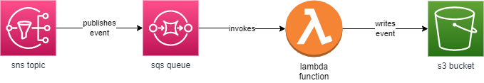

# Find an SQS Event

This repository provides:

* A [stack](blob/main/lib/find-an-sqs-event-stack.ts) that sets up the following infrastructure:

* Scripts to generate events via the sns topic and then search in the stored events in the s3 bucket

## Build and deploy the demo stack

* `npm run build`   compile typescript to js
* `cdk deploy`      deploy this stack to your default AWS account/region

## Generate event files

Need to make scripts executable (`chmod u+x *.sh`).

`./generate-messages.sh -t "<topic arn>" -i <number of events>`

* `-t|--topic <value>` - the arn of the topic deployed
* `-i|--iterations <value>` - the number of events to generate

## Finding an event

`./find-file.sh -b "<bucket name>" -p "<prefix>" -n "<grep pattern>"`

* `-b|--bucket <value>` - the bucket to search
* `-p|--prefix <value>` (optional) - the prefix (or folder) to search
* `-o|--objectCount <value>` (optional) - the number of object keys to retrieve from the bucket at one time
* `-n|--pattern <value>` - the grep pattern to use to test messages in files
* `-m|--manyMatches` - when included flags that the script should carry on past the first match
* `-j|--jsonPath <value>` - a jq json path within the file to extract
* `-i|--iterations <value>` - the maximum number of times to retrieve object keys from the bucket
